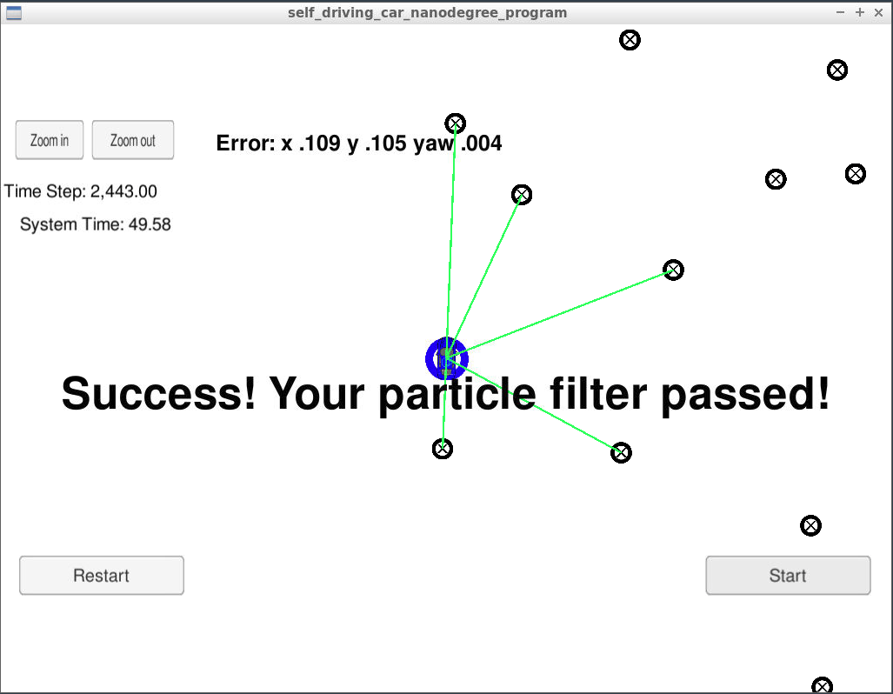

# Particle Filter Project
Self-Driving Car Engineer Nanodegree Program

## Overview

In this project, I used C++ to implement Particle Filter to localize a vehicle kidnapped in a closed enviorment. The error for GPS is normally 3-10 meter, which is unaccepted for self-driving car to localize itself when it is driving. So it is necessary to take advantage of other sensor with higher accuracy, such LIDAR, RADAR, odometry. That is reason why we need implement Particle filter for vehicle localization. The  Velocity and yaw rate data collected by other sensor like odometry, are used for predicting the next possible positions by implementing normal distribution. Then by calculating the weight from landmarks observation data captured from Lidar or radar the most likely position can be selected.

## Environment Setup
Assume that you have already install all Dependencies tools: 
1. mkdir build
2. cd build
3. cmake ..
4. make
5. ./particle_filter

## Result

The Final result is

| Parameter                        |     Error                       |
|:---------------------:|:---------------------------------------------:|
| X                 | 0.114                                 |
| Y             | 0.110 |
| Yaw         | 0.004   |
